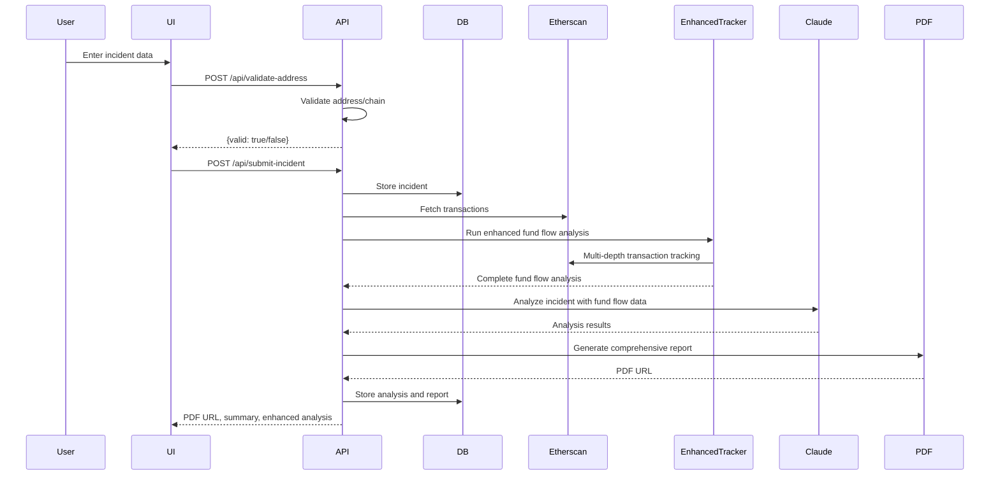

# Web3 Hack Evidence Aggregator – Architecture & Design Document

**Version:** v1.0.0  
**Status:** Implemented and Production Ready  
**Date:** January 2025  
**Prepared by:** Architecture & Design Agent

---

## 1. High-Level System Architecture

### 1.1 Architecture Diagram

```mermaid
flowchart TD
    UI[User Interface (Next.js)]
    API[API Layer (Next.js API Routes)]
    DB[(PostgreSQL)]
    Etherscan[Etherscan/Polygonscan/BSCScan/Arbiscan APIs]
    Claude[Claude API (Anthropic)]
    PDF[PDF Generator]
    EnhancedTracker[Enhanced Fund Flow Tracker]
    
    UI --> API
    API --> DB
    API --> Etherscan
    API --> Claude
    API --> PDF
    API --> EnhancedTracker
    EnhancedTracker --> Etherscan
    PDF --> UI
```

### 1.2 Component Overview

| Component         | Technology         | Responsibility                                      | Status |
|------------------ | ----------------- | --------------------------------------------------- | ------- |
| UI                | Next.js (TS)      | User input, report viewing, error display           | ✅ Complete |
| API Layer         | Next.js API Routes| Orchestration, validation, aggregation, error mgmt  | ✅ Complete |
| Database          | PostgreSQL        | Incident, cache, and report storage                 | ✅ Complete |
| Blockchain APIs   | Etherscan, etc.   | Transaction and address data                        | ✅ Complete |
| AI Engine         | Claude API        | Incident analysis, summary, timeline, loss calc     | ✅ Complete |
| PDF Generator     | pdf-lib           | Generate law enforcement-ready PDF reports          | ✅ Complete |
| Enhanced Tracker  | Custom Algorithm  | Advanced fund flow tracking and pattern detection   | ✅ Complete |

---

## 2. Detailed Component Design

### 2.1 User Interface (UI) - ✅ IMPLEMENTED

- **Framework:** Next.js 15 (TypeScript)
- **Features:**
  - ✅ Wallet address input (with chain selection)
  - ✅ Incident description (multi-line)
  - ✅ Date/time picker
  - ✅ Optional transaction hash
  - ✅ Responsive design (mobile-first)
  - ✅ Error and status messages
  - ✅ PDF report viewing/downloading
  - ✅ Enhanced fund flow analysis interface
  - ✅ Interactive Sankey diagram visualization

#### UI State Flow - ✅ IMPLEMENTED

1. ✅ User enters data → triggers `/api/validate-address`
2. ✅ On valid input, submits incident → `/api/submit-incident`
3. ✅ UI polls for analysis/report status
4. ✅ Displays PDF report or error
5. ✅ Enhanced analysis with fund flow tracking
6. ✅ Interactive visualization of results

---

### 2.2 API Layer - ✅ IMPLEMENTED

- **Framework:** Next.js API Routes (TypeScript)
- **Endpoints:**
  - ✅ `/api/validate-address`
  - ✅ `/api/submit-incident`
  - ✅ `/api/incident/:id/data`
  - ✅ `/api/incident/:id/enhanced-mapping`
  - ✅ `/api/incident/:id/report`
  - ✅ `/api/analysis`
  - ✅ `/api/cache` (internal)

#### API Flow - ✅ IMPLEMENTED

1. ✅ **Validation:** Checks address format and chain support.
2. ✅ **Submission:** Stores incident, triggers data aggregation.
3. ✅ **Aggregation:** Fetches transactions (Etherscan, etc.), caches results.
4. ✅ **Enhanced Analysis:** Runs sophisticated fund flow tracking algorithm.
5. ✅ **AI Analysis:** Sends data to Claude API, receives summary, timeline, attack vectors, loss.
6. ✅ **Report Generation:** Compiles all data into a PDF, stores and returns URL.

#### Error Handling - ✅ IMPLEMENTED

- ✅ All endpoints return `{ success: false, error: string }` on failure.
- ✅ API failures are logged and surfaced to the user with actionable messages.
- ✅ Rate limiting and retries for external APIs.

---

### 2.3 Database Schema - ✅ IMPLEMENTED

#### incidents - ✅ IMPLEMENTED

| Field           | Type      | Description                        | Status |
|-----------------|-----------|------------------------------------| ------- |
| id              | UUID      | Incident ID (PK)                   | ✅ Complete |
| wallet_address  | VARCHAR   | User's wallet address              | ✅ Complete |
| chain           | VARCHAR   | Chain name                         | ✅ Complete |
| description     | TEXT      | Incident description               | ✅ Complete |
| discovered_at   | TIMESTAMP | Hack discovery time                | ✅ Complete |
| tx_hash         | VARCHAR   | (Optional) Transaction hash        | ✅ Complete |
| created_at      | TIMESTAMP | Submission time                    | ✅ Complete |
| report_status   | VARCHAR   | [pending, complete, error]         | ✅ Complete |

#### analysis - ✅ IMPLEMENTED

| Field           | Type      | Description                        | Status |
|-----------------|-----------|------------------------------------| ------- |
| id              | UUID      | Analysis ID (PK)                   | ✅ Complete |
| incident_id     | UUID      | Linked incident (FK)               | ✅ Complete |
| analysis_data   | JSONB     | Complete fund flow analysis        | ✅ Complete |
| created_at      | TIMESTAMP | Creation time                      | ✅ Complete |

#### api_cache - ✅ IMPLEMENTED

| Field         | Type      | Description                        | Status |
|---------------|-----------|------------------------------------| ------- |
| id            | UUID      | Cache entry ID (PK)                | ✅ Complete |
| key           | VARCHAR   | Unique cache key                   | ✅ Complete |
| data          | JSONB     | Cached API response                | ✅ Complete |
| created_at    | TIMESTAMP |                                   | ✅ Complete |
| expires_at    | TIMESTAMP |                                   | ✅ Complete |

#### reports - ✅ IMPLEMENTED

| Field         | Type      | Description                        | Status |
|---------------|-----------|------------------------------------| ------- |
| id            | UUID      | Report ID (PK)                     | ✅ Complete |
| incident_id   | UUID      | Linked incident (FK)               | ✅ Complete |
| pdf_url       | VARCHAR   | PDF storage location               | ✅ Complete |
| summary       | TEXT      | AI-generated summary               | ✅ Complete |
| created_at    | TIMESTAMP |                                   | ✅ Complete |

---

### 2.4 External Integrations - ✅ IMPLEMENTED

- ✅ **Etherscan/Polygonscan/BSCScan/Arbiscan:** Transaction and address data (API key, rate limits, error handling)
- ✅ **Claude API:** Incident analysis (secure API key management, error handling)
- ✅ **PDF Generator:** pdf-lib for PDF creation

---

### 2.5 Enhanced Fund Flow Analysis Engine - ✅ IMPLEMENTED

- **Implementation:** `user-interface/src/services/enhanced-fund-tracker.ts`
- **Input:** Victim wallet address, hack timestamp, chain information
- **Output:** 
  - ✅ Multi-depth fund flow tracking (up to 6 levels)
  - ✅ Pattern detection (peel chains, rapid turnover, coordinated movements)
  - ✅ Risk assessment with scoring algorithms
  - ✅ Address classification (exchange, mixer, bridge, DeFi, wallet)
  - ✅ Endpoint detection for final destinations
  - ✅ Deterministic results for forensic integrity

- **Integration:** Fully integrated with API layer and frontend

---

### 2.6 AI Analysis Engine - ✅ IMPLEMENTED

- **Input:** Aggregated transaction and fund flow data, incident description
- **Output:** 
  - ✅ Suspicious transaction timeline
  - ✅ Attack vector identification
  - ✅ Total loss calculation (USD)
  - ✅ Law enforcement-ready summary

- **Integration:** Claude API (Anthropic) via secure backend call

---

### 2.7 PDF Report Generation - ✅ IMPLEMENTED

- **Input:** All incident, analysis, and evidence data
- **Output:** Downloadable PDF (professional, law enforcement-ready)
- **Libraries:** pdf-lib
- **Features:** Legal disclaimers, summary, timeline, loss, attack vector, evidence, fund flow analysis

---

## 3. Data Flow & State Management - ✅ IMPLEMENTED

### 3.1 Sequence Diagram



---

## 4. Error Handling & Logging - ✅ IMPLEMENTED

- ✅ All API calls wrapped with try/catch and error logging
- ✅ User-facing errors are actionable and non-technical
- ✅ External API failures trigger retries and fallback messaging
- ✅ All errors logged with timestamp, endpoint, and context
- ✅ Privacy: No sensitive user data in logs

---

## 5. Scalability & Performance - ✅ IMPLEMENTED

- ✅ **API Caching:** Prevents redundant calls, reduces cost/latency
- ✅ **Rate Limiting:** Per-user and per-API to avoid abuse and cost overruns
- ✅ **Async Processing:** Long-running tasks (AI, PDF) handled asynchronously, with status polling
- ✅ **Database Indexing:** On incident/report IDs for fast lookup
- ✅ **Stateless API:** Enables horizontal scaling (Vercel/serverless)
- ✅ **Enhanced Algorithm:** Optimized fund flow tracking with early termination

---

## 6. Security & Compliance - ✅ IMPLEMENTED

- ✅ No private keys or sensitive PII stored
- ✅ GDPR-compliant data retention (configurable)
- ✅ All API keys stored securely (env vars, secrets manager)
- ✅ Legal disclaimers in all reports and UI
- ✅ HTTPS enforced for all endpoints
- ✅ Input validation and sanitization

---

## 7. Implementation Guidelines - ✅ IMPLEMENTED

### 7.1 Coding Standards - ✅ IMPLEMENTED

- ✅ TypeScript for all code (frontend and backend)
- ✅ Consistent naming: kebab-case for files, camelCase for variables
- ✅ Modular structure: `/components`, `/api`, `/db`, `/utils`, `/services`
- ✅ Inline documentation for all functions/classes
- ✅ Use environment variables for all secrets

### 7.2 File Structure - ✅ IMPLEMENTED

```
user-interface/src/
├── app/                    # Next.js app router
│   ├── Analyse.tsx        # Enhanced analysis interface
│   ├── IncidentForm.tsx   # Incident submission
│   ├── ConsultReport.tsx  # Report consultation
│   ├── Mapping.tsx        # Fund flow mapping
│   └── api/               # API routes
├── services/               # Service layer
│   ├── enhanced-fund-tracker.ts  # Enhanced fund flow algorithm
│   ├── etherscan-fixed.ts        # Etherscan integration
│   ├── claude.ts                 # AI analysis
│   └── types/                    # TypeScript types
├── db/                     # Database client
└── components/             # Reusable UI components
```

### 7.3 Development Environment - ✅ IMPLEMENTED

- ✅ Node.js LTS, Next.js 15, TypeScript
- ✅ PostgreSQL (local or managed)
- ✅ .env.example for required environment variables
- ✅ Prettier, ESLint for code quality

### 7.4 Build & Deployment - ✅ IMPLEMENTED

- ✅ Vercel for serverless deployment (or similar)
- ✅ CI/CD: Lint, test, build, deploy
- ✅ Database migrations via SQL scripts

---

## 8. Design Artifacts & Templates - ✅ IMPLEMENTED

- ✅ `/docs/architecture/` – This document, diagrams, rationale
- ✅ `/docs/design/` – Module/class diagrams, interface specs, pseudocode
- ✅ `/docs/architecture/high-level-diagram.md` – Mermaid/PNG diagram
- ✅ `/docs/design/api-contracts.md` – Endpoint and payload definitions
- ✅ `/docs/design/db-schema.md` – Table definitions and ERD
- ✅ `/docs/design/ai-analysis.md` – Claude prompt/response structure
- ✅ `/docs/design/pdf-template.md` – PDF layout and content structure

---

## 9. Decision Rationale - ✅ IMPLEMENTED

- ✅ **Next.js 15:** Unified frontend/backend, rapid prototyping, Vercel support
- ✅ **PostgreSQL:** Reliable, scalable, strong JSON support for caching
- ✅ **Claude API:** Advanced AI analysis, law enforcement-grade summaries
- ✅ **pdf-lib:** Flexible, programmatic PDF generation
- ✅ **API-first:** Enables future mobile/native clients
- ✅ **Enhanced Algorithm:** Sophisticated fund flow tracking for professional forensics

---

## 10. Assumptions & Constraints - ✅ IMPLEMENTED

- ✅ All third-party APIs are available and stable
- ✅ No user authentication (MVP scope)
- ✅ Data retention period is configurable
- ✅ PDF storage is local or cloud (configurable)
- ✅ MVP is privacy-first, no sensitive data stored
- ✅ Enhanced fund flow tracking is production-ready

---

## 11. Change Log

| Version | Date       | Author         | Description         |
|---------|------------|----------------|---------------------|
| v1.0.0  | 2025-01-XX | A&D Agent      | Updated to reflect current implementation |

---

## 12. Approval

| Name            | Role                | Signature | Date       |
|-----------------|---------------------|-----------|------------|
|                 | Architecture Agent  |           |            |
|                 | Product Owner       |           |            |
|                 | Peer Reviewer       |           |            |

---

**End of Document**

---

**Current Status:**  
✅ **FULLY IMPLEMENTED AND PRODUCTION READY**  
- All planned features are implemented and operational  
- Enhanced fund flow tracking algorithm is complete  
- Interactive visualization system is functional  
- Professional PDF reporting is working  
- AI-powered analysis is integrated  

**Next Steps:**  
- Focus on user adoption and training  
- Performance optimization based on real usage  
- Feature enhancements based on user feedback  
- Documentation updates for end users

