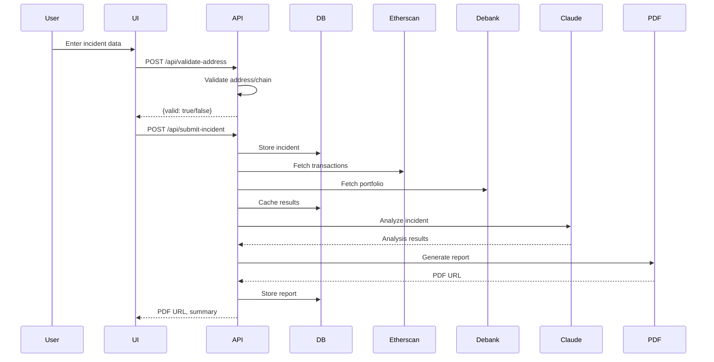

# Web3 Hack Evidence Aggregator – Architecture & Design Document

**Version:** v1.0.0  
**Status:** Draft (Pending Approval)  
**Date:** 2024-06-11  
**Prepared by:** Architecture & Design Agent

---

## 1. High-Level System Architecture

### 1.1 Architecture Diagram

```mermaid
flowchart TD
    UI[User Interface (Next.js)]
    API[API Layer (Next.js API Routes)]
    DB[(PostgreSQL)]
    Etherscan[Etherscan/Polygonscan/BSCScan/Arbiscan APIs]
    Debank[Debank API]
    Claude[Claude API (Anthropic)]
    PDF[PDF Generator]
    UI --> API
    API --> DB
    API --> Etherscan
    API --> Debank
    API --> Claude
    API --> PDF
    PDF --> UI
```

### 1.2 Component Overview

| Component      | Technology         | Responsibility                                      |
| -------------- | ----------------- | --------------------------------------------------- |
| UI             | Next.js (TS)      | User input, report viewing, error display           |
| API Layer      | Next.js API Routes| Orchestration, validation, aggregation, error mgmt  |
| Database       | PostgreSQL        | Incident, cache, and report storage                 |
| Blockchain APIs| Etherscan, etc.   | Transaction and address data                        |
| Debank API     | Debank            | Portfolio and asset data                            |
| AI Engine      | Claude API        | Incident analysis, summary, timeline, loss calc     |
| PDF Generator  | pdf-lib/puppeteer | Generate law enforcement-ready PDF reports          |

---

## 2. Detailed Component Design

### 2.1 User Interface (UI)

- **Framework:** Next.js (TypeScript)
- **Features:**
  - Wallet address input (with chain selection)
  - Incident description (multi-line)
  - Date/time picker
  - Optional transaction hash
  - Responsive design (mobile-first)
  - Error and status messages
  - PDF report viewing/downloading

#### UI State Flow

1. User enters data → triggers `/api/validate-address`
2. On valid input, submits incident → `/api/submit-incident`
3. UI polls for analysis/report status
4. Displays PDF report or error

---

### 2.2 API Layer

- **Framework:** Next.js API Routes (TypeScript)
- **Endpoints:**
  - `/api/validate-address`
  - `/api/submit-incident`
  - `/api/incident/:id/data`
  - `/api/incident/:id/analyze`
  - `/api/incident/:id/report`
  - `/api/cache` (internal)

#### API Flow

1. **Validation:** Checks address format and chain support.
2. **Submission:** Stores incident, triggers data aggregation.
3. **Aggregation:** Fetches transactions (Etherscan, etc.), portfolio (Debank), caches results.
4. **AI Analysis:** Sends data to Claude API, receives summary, timeline, attack vectors, loss.
5. **Report Generation:** Compiles all data into a PDF, stores and returns URL.

#### Error Handling

- All endpoints return `{ success: false, error: string }` on failure.
- API failures are logged and surfaced to the user with actionable messages.
- Rate limiting and retries for external APIs.

---

### 2.3 Database Schema

#### incidents

| Field           | Type      | Description                        |
|-----------------|-----------|------------------------------------|
| id              | UUID      | Incident ID (PK)                   |
| wallet_address  | VARCHAR   | User's wallet address              |
| chain           | VARCHAR   | Chain name                         |
| description     | TEXT      | Incident description               |
| discovered_at   | TIMESTAMP | Hack discovery time                |
| tx_hash         | VARCHAR   | (Optional) Transaction hash        |
| created_at      | TIMESTAMP | Submission time                    |
| report_status   | VARCHAR   | [pending, complete, error]         |

#### api_cache

| Field         | Type      | Description                        |
|---------------|-----------|------------------------------------|
| id            | UUID      | Cache entry ID (PK)                |
| key           | VARCHAR   | Unique cache key                   |
| data          | JSONB     | Cached API response                |
| created_at    | TIMESTAMP |                                   |
| expires_at    | TIMESTAMP |                                   |

#### reports

| Field         | Type      | Description                        |
|---------------|-----------|------------------------------------|
| id            | UUID      | Report ID (PK)                     |
| incident_id   | UUID      | Linked incident (FK)               |
| pdf_url       | VARCHAR   | PDF storage location               |
| summary       | TEXT      | AI-generated summary               |
| created_at    | TIMESTAMP |                                   |

---

### 2.4 External Integrations

- **Etherscan/Polygonscan/BSCScan/Arbiscan:** Transaction and address data (API key, rate limits, error handling)
- **Debank API:** Portfolio and asset data
- **Claude API:** Incident analysis (secure API key management, error handling)
- **PDF Generator:** pdf-lib, puppeteer, or react-pdf for PDF creation

---

### 2.5 AI Analysis Engine

- **Input:** Aggregated transaction and portfolio data, incident description
- **Output:** 
  - Suspicious transaction timeline
  - Attack vector identification
  - Total loss calculation (USD)
  - Law enforcement-ready summary

- **Integration:** Claude API (Anthropic) via secure backend call

---

### 2.6 PDF Report Generation

- **Input:** All incident, analysis, and evidence data
- **Output:** Downloadable PDF (professional, law enforcement-ready)
- **Libraries:** pdf-lib, puppeteer, or react-pdf
- **Features:** Legal disclaimers, summary, timeline, loss, attack vector, evidence

---

## 3. Data Flow & State Management

### 3.1 Sequence Diagram



---

## 4. Error Handling & Logging

- All API calls wrapped with try/catch and error logging
- User-facing errors are actionable and non-technical
- External API failures trigger retries and fallback messaging
- All errors logged with timestamp, endpoint, and context
- Privacy: No sensitive user data in logs

---

## 5. Scalability & Performance

- **API Caching:** Prevents redundant calls, reduces cost/latency
- **Rate Limiting:** Per-user and per-API to avoid abuse and cost overruns
- **Async Processing:** Long-running tasks (AI, PDF) handled asynchronously, with status polling
- **Database Indexing:** On incident/report IDs for fast lookup
- **Stateless API:** Enables horizontal scaling (Vercel/serverless)

---

## 6. Security & Compliance

- No private keys or sensitive PII stored
- GDPR-compliant data retention (configurable)
- All API keys stored securely (env vars, secrets manager)
- Legal disclaimers in all reports and UI
- HTTPS enforced for all endpoints

---

## 7. Implementation Guidelines

### 7.1 Coding Standards

- TypeScript for all code (frontend and backend)
- Consistent naming: kebab-case for files, camelCase for variables
- Modular structure: `/components`, `/api`, `/db`, `/utils`, `/services`
- Inline documentation for all functions/classes
- Use environment variables for all secrets

### 7.2 File Structure

```
/components         # React UI components
/pages/api          # Next.js API routes
/db                 # Database models and queries
/services           # External API integrations (Etherscan, Debank, Claude, PDF)
/utils              # Utility functions (validation, formatting, etc.)
/public/reports     # PDF storage (if not using cloud)
.env                # Environment variables
```

### 7.3 Development Environment

- Node.js LTS, Next.js, TypeScript
- PostgreSQL (local or managed)
- .env.example for required environment variables
- Prettier, ESLint for code quality

### 7.4 Build & Deployment

- Vercel for serverless deployment (or similar)
- CI/CD: Lint, test, build, deploy
- Database migrations via Prisma or similar ORM

---

## 8. Design Artifacts & Templates

- `/docs/architecture/` – This document, diagrams, rationale
- `/docs/design/` – Module/class diagrams, interface specs, pseudocode
- `/docs/architecture/high-level-diagram.md` – Mermaid/PNG diagram
- `/docs/design/api-contracts.md` – Endpoint and payload definitions
- `/docs/design/db-schema.md` – Table definitions and ERD
- `/docs/design/ai-analysis.md` – Claude prompt/response structure
- `/docs/design/pdf-template.md` – PDF layout and content structure

---

## 9. Decision Rationale

- **Next.js**: Unified frontend/backend, rapid prototyping, Vercel support
- **PostgreSQL**: Reliable, scalable, strong JSON support for caching
- **Claude API**: Advanced AI analysis, law enforcement-grade summaries
- **pdf-lib/puppeteer**: Flexible, programmatic PDF generation
- **API-first**: Enables future mobile/native clients

---

## 10. Assumptions & Constraints

- All third-party APIs are available and stable
- No user authentication (MVP scope)
- Data retention period is configurable
- PDF storage is local or cloud (configurable)
- MVP is privacy-first, no sensitive data stored

---

## 11. Change Log

| Version | Date       | Author         | Description         |
|---------|------------|----------------|---------------------|
| v1.0.0  | 2024-06-11 | A&D Agent      | Initial architecture/design |

---

## 12. Approval

| Name            | Role                | Signature | Date       |
|-----------------|---------------------|-----------|------------|
|                 | Architecture Agent  |           |            |
|                 | Product Owner       |           |            |
|                 | Peer Reviewer       |           |            |

---

**End of Document**

---

**Next Steps:**  
- Review and approve this document  
- Proceed to detailed module/class design in `/docs/design/`  
- Begin implementation following this architecture

---

